<div align="center">

<p align="center"></p>

<p align="center"></p>

<p align="center"></p>

<br/>

[](https://github.com/mahira-manico)
[](https://github.com/mahira-manico)

</div>

## 🎀 Quick Intro

**English Literature → Visual Arts → Software Development**

IT student at **La Plateforme_** (Marseille). My background in arts and languages shaped how I approach code: with rigor, attention to detail, and a strong sense of design. I build complete, structured projects and care about clean architecture.

💼 **Currently:** work-study (alternance) at **Thom Horizon**, Aubagne
📍 **Based in:** Marseille, France

<div align="center"></div>

## 🛠️ Tech Stack

<div align="center">


</div>

### 🧩 Frameworks & Tools

<div align="center">

| | |
|:--|:--|
| **🖥️ Frameworks & libraries** |       |
| **🧰 Dev tools** |      |
| **🚀 Deploy** |  |
| **📐 Concepts** |         |

</div>

**Also:** Strategy & Builder patterns · SQL · Git workflow · Code reviews · Agile teamwork

<div align="center"></div>

## 💗 Featured Projects

### 🛒 [Le Comptoir](https://github.com/mahira-manico/LeComptoir) (Team)
Checkout engine in pure OOP — Java 21 · strict TypeScript demo
- **Strategy** pattern for discount selection, **Builder** pattern for receipt construction
- No web framework on purpose: the point is object design and strict encapsulation
- Cross-audit with a partner repo, written response, before/after UML diagrams, tagged releases `v1` → `v6`

### 🌸 [Girly App](https://github.com/mahira-manico/girlyApp) · [Live on Netlify](https://girlyappon.netlify.app/)
Personal dashboard & safe space with a Y2K aesthetic — HTML5 · Sass · Vanilla JS · Fetch API
- Interactive **Task Board** and **Mood Board** (DOM manipulation, event listeners, timers)
- Product suggestions generated asynchronously from an external API (FakeStoreAPI)
- Mobile-first with Flexbox & Grid, no heavy framework (Sass only), native `<dialog>` popups
- **Eco-design:** `.webp` images, `.webm` video instead of a heavy GIF, static image fallback on mobile
- **Accessibility:** `aria-label` / `aria-hidden` used systematically, semantic HTML
- Validated for **RNCP 37273 (Bloc 2)** at La Plateforme, built in 3 weeks

| Lighthouse | Performance | Accessibility | Best Practices | SEO |
|------------|:-----------:|:-------------:|:--------------:|:---:|
| 💻 Desktop | 98% | 89% | 100% | 91% |
| 📱 Mobile  | 77% | 92% | — | — |

### 🎓 [La Plateforme_ Tracker](https://github.com/mahira-manico/LaplateformeTracker) (Team)
Student management app — Java 21 · JavaFX · PostgreSQL · JDBC
- Secure authentication · Full CRUD · Advanced search & dynamic sorting
- Import/Export CSV, XML, JSON · Class statistics · Pagination · Auto-save
- **My work:** All FXML files · Main Controller · UI architecture

### 💰 [Budget Buddy](https://github.com/mahira-manico/budget_buddy) (Team)
Personal finance app — Python · CustomTkinter · SQLite
- MVC architecture · Real-time data visualization · SQLite persistence
- Input validation · Edge case handling
- **My work:** Team development · Git workflow · Code reviews

### 🎮 [Pokémon Adventure – RPG Battle](https://github.com/mahira-manico/pokemon)
Modular RPG — Python · Pygame · JSON
- Clean Architecture (domain / application / infrastructure)
- Complex state management · Data persistence · Dynamic UI

### 🎮 [Hangman Game](https://github.com/samba-gomis/pendu)
Complete Pygame app with modular architecture
- 8-file structure (MVC-inspired) · 3 difficulty levels · Scoring · Sound

### ⚓ [Ship of Theseus](https://github.com/mahira-manico/ship-of-theseus)
Philosophical paradox meets OOP
- Inheritance · Encapsulation · Reference vs value

<div align="center"></div>

## 📊 GitHub Stats

<div align="center">

<!-- Generated daily by the "Metrics" GitHub Action (see .github/workflows/metrics.yml) -->
<p align="center"></p>

<p align="center"></p>

</div>

<div align="center"></div>

## 🚀 What I Bring

- **Rigorous:** Clean code, proper architecture, attention to detail
- **Autonomous:** Self-taught, capable of managing projects end to end
- **Collaborative:** Agile teamwork, code reviews, clear communication
- **Proactive:** Initiative-taking, continuous improvement mindset
- **Creative:** Arts & design background, strong UI/UX sensibility

## 🌷 Current Focus

```python
learning = {
    "now":  ["Java", "Spring Boot", "React", "TypeScript", "C++", "Sass"],
    "next": ["C", "C#"],
    "goal": "Real-world team development, one clean commit at a time"
}
```

## 📫 Connect

💼 **Open to:** collaborations and cool projects
🔗 **LinkedIn:** [mahira-manico](https://www.linkedin.com/in/mahira-manico)
🌐 **Portfolio:** [mahira-manico.github.io](https://mahira-manico.github.io/)
📍 **Location:** Marseille, France

<div align="center">

[](https://github.com/mahira-manico)


*"Same creative process, different medium — from art to code."* 🎀

</div>
